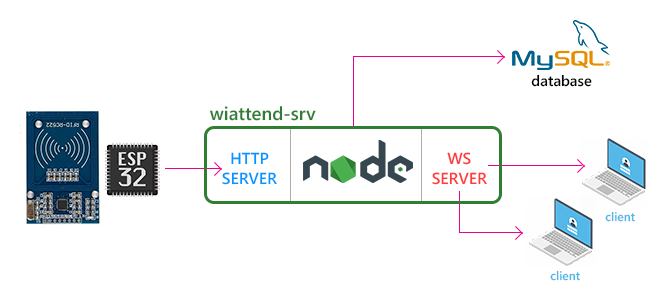

# wiattend-srv
[NodeJS](https://nodejs.org) server for RFID attendance system [wiattend](https://github.com/abobija/wiattend). Server uses [MySQL](https://www.mysql.com) database management system.

## Usage

Run next commands for install dependencies and start the server

```
npm install
npm start
```

## Abstraction



## Demo

[](https://www.youtube.com/watch?v=TH8eR9hSwzc)

## HTTP Routes

All routes returns response in `JSON` format.

- `GET /logs`

  **Returns** 
  
  Last 20 logs from database.

- `GET /tags`

  **Returns**
  
  All tags from database.
 
- `POST /log`

  **Accept**
  
  This route requires next HTTP headers:
  
  | Header name | Header value |
  | --- | --- |
  | `sguid` | **2ce81521-c42f-4556-8c28-c69d7e3a3a47** |
  | `rfid-tag` | _Serial number of tag_ |
  
  **Returns**
  
  Logged tag.

## WebSocket events

All messages broadcasted to clients are formated in `JSON` style.

```json
{
 "event": "event_name",
 "data": {}
}
```

- **logged**

  Data of event ``logged`` represents logged tag. If ``next_direction`` proprety of logged tag is ``-1`` that means the user of tag is now present, otherwise (if it is ``1``) user is absent.

  ```json 
  "event": "logged",
  "data": {
    "id": 3, 
    "uid": "0x79 0x09 0x08 0x85 0xFD", 
    "first_name": "Nikola", 
    "last_name": "Tesla", 
    "next_direction": 1
   }
   ```
